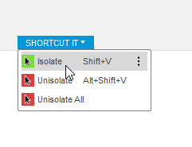

# ShortcutItPy

This small add-in for Fusion 360 adds icons to some commands and puts them in
a panel so you can add shortcuts for them.

Currently the commands include:
- Isolate
- Unisolate
- Unisolate All
- Find in Browser (the add-in must be re-run after startup to list this,
  not sure why. The shortcut stays across startups though so it's not a
  problem)
- Remove
- Activate Component
- Set Orbit Center

If you want me to add another, please file an issue on this repository or make
a pull request to add it.

## Contributing
Thanks for the interest in this repository! To add a command, first find its
name. I ship a script in DumpCmdDefs/ which can do this. Copy this directory
into your Scripts folder and run the script. It will dump out all the commands
with their internal IDs to a txt file.

Once you have found the command you want to add, include it in the `needCmdDefs`
tuple in `ShortcutItPy.py`. This tuple is formatted in the following format:
`(CommandName, IconsDir)`. Commands need to have icons so the shortcut
option is shown. If a command already has an icon, simply put `None` in place of
the `IconsDir` as we don't need to add one.

Stop and start the extension in Fusion, then try the command. Not every command
will actually work if you put it in a menu unfortunately. If it works, please
commit it and send it in as a pull request! I'd love to see what is useful to
you.

### Legal

The iconography used is Adwaita from the GNOME project. It is licensed under
either LGPLv3 or CC-BY-SA, and so are my modifications.

The code in this project is licensed under the MIT license unless otherwise
specified in the file header.
